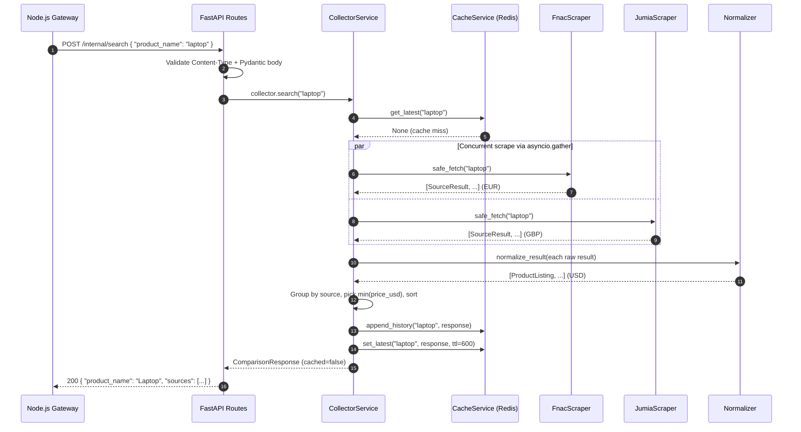

# Python Data Collector Service

**Project:** Cross-Platform Product Aggregator: A Microservices Case Study  
**Service:** Python Data Collector  
**Runtime:** Python 3.11 / FastAPI 0.108 / Uvicorn 0.25  
**Role:** Internal price-aggregation microservice

---

## Table of Contents

1. [Overview](#1-overview)
2. [Architecture](#2-architecture)
3. [Endpoints](#3-endpoints)
4. [Data Flow](#4-data-flow)
5. [Redis Caching Strategy](#5-redis-caching-strategy)
6. [Data Normalization](#6-data-normalization)
7. [Environment Variables](#7-environment-variables)
8. [Docker Deployment](#8-docker-deployment)
9. [Inter-Service Communication](#9-inter-service-communication)
10. [Error Handling](#10-error-handling)
11. [Limitations and Future Improvements](#11-limitations-and-future-improvements)
12. [Sequence Diagram](#12-sequence-diagram)

---

## 1. Overview

The Python Data Collector Service is a self-contained internal microservice responsible for aggregating product price data from multiple simulated data sources. It normalizes all collected prices to a uniform USD format, caches results in Redis, and returns structured JSON responses to its sole authorized caller: the Node.js API Gateway.

**Responsibilities:**

- Fetch product price listings from at least two independent adapter-based sources concurrently.
- Normalize raw price data — converting currencies to USD and standardizing product name formatting.
- Cache the latest result under a short TTL key and maintain a full append-only price history in Redis.
- Return a structured, source-keyed JSON comparison to the Node.js Gateway.

**Out of scope for this service:**

- User authentication and authorization (owned by the Node.js Gateway).
- Frontend rendering or browser-facing logic.
- Database persistence beyond Redis caching.
- Public-facing API exposure.

---

## 2. Architecture

### Folder Structure

```
python-collector/
├── Dockerfile
├── requirements.txt
├── .env.example
└── app/
    ├── main.py               # Application factory, lifespan, exception handlers
    ├── config.py             # Pydantic-settings configuration, env var resolution
    ├── api/
    │   ├── __init__.py
    │   └── routes.py         # FastAPI routers: /internal/search, /health
    ├── models/
    │   ├── product.py        # SourceResult, ProductListing (domain models)
    │   ├── requests.py       # SearchRequest (inbound payload)
    │   └── responses.py      # ComparisonResponse, SourceEntry, ErrorResponse, HealthResponse
    ├── scrapers/
    │   ├── base.py           # Abstract BaseScraper + safe_fetch() wrapper
    │   ├── source_a.py       # FnacScraper — Fnac (EUR)
    │   └── source_b.py       # JumiaScraper — Jumia Morocco (MAD)
    ├── services/
    │   ├── cache_service.py  # All Redis interactions (get/set latest + history)
    │   └── collector_service.py  # Orchestration: scrape → normalize → cache → respond
    └── utils/
        └── normalizer.py     # Currency conversion table, normalize_result()
```

### Separation of Concerns

| Layer | Module(s) | Responsibility |
|---|---|---|
| API | `api/routes.py` | Request validation, Content-Type enforcement, error surfacing |
| Services | `services/collector_service.py` | Orchestration: fan-out, normalize, sort, persist |
| Cache | `services/cache_service.py` | Isolated Redis client; no other module touches Redis directly |
| Scrapers | `scrapers/base.py`, `source_a.py`, `source_b.py` | Adapter pattern; each source implements a common interface |
| Models | `models/` | Typed Pydantic v2 contracts for every request and response shape |
| Utilities | `utils/normalizer.py` | Stateless price and currency normalization functions |
| Config | `config.py` | Single source of truth for all environment variables |

### Async Architecture

The service is built on **FastAPI** with an async-first design using `asyncio`. The `CollectorService.search()` method dispatches all scraper tasks simultaneously via `asyncio.gather`, so source latency is bounded by the slowest source rather than the sum of all sources. `httpx.AsyncClient` is instantiated once at startup and shared across all scrapers to enable connection pooling.

---

## 3. Endpoints

### POST /internal/search

**Purpose:** Accept a product name from the Node.js Gateway, aggregate prices from all registered sources, and return a normalized per-source comparison sorted cheapest-first.

This endpoint is explicitly marked internal. It must not be reachable from public internet traffic. The `/internal` prefix is a deliberate naming convention; a reverse proxy or firewall must deny all external requests matching `/internal/*`.

**Request**

```
POST /internal/search
Content-Type: application/json
```

```json
{
  "product_name": "wireless headphones"
}
```

| Field | Type | Constraints | Description |
|---|---|---|---|
| `product_name` | string | 1–200 characters, non-blank | Name of the product to search for |

**Response — 200 OK**

```json
{
  "product_name": "Wireless Headphones",
  "sources": [
    {
      "source": "Fnac",
      "price": 199.99,
      "currency": "USD",
      "url": "https://www.fnac.com/SearchResult/ResultList.aspx?Search=wireless+headphones&item=0",
      "in_stock": true
    },
    {
      "source": "Jumia",
      "price": 130.00,
      "currency": "USD",
      "url": "https://www.jumia.ma/catalog/?q=wireless+headphones&item=0",
      "in_stock": false
    }
  ],
  "cached": false,
  "timestamp": "2026-02-18T10:00:00+00:00"
}
```

| Field | Description |
|---|---|
| `product_name` | Normalized (title-cased) echo of the search query |
| `sources` | One entry per data source, reflecting its lowest USD price |
| `cached` | `true` when the response was served from the `latest_price` Redis key |
| `timestamp` | UTC timestamp of response generation |

**Normalization applied:** Raw prices (EUR for Fnac, MAD for Jumia) are converted to USD using a static exchange-rate table before the comparison list is built. Only the cheapest listing per source is included.

**Error responses** follow the uniform `ErrorResponse` envelope:

```json
{
  "detail": "This endpoint accepts application/json only.",
  "status_code": 400,
  "timestamp": "2026-02-18T10:00:01+00:00"
}
```

| Status | Condition |
|---|---|
| `400` | Content-Type is not `application/json` |
| `422` | Request body fails Pydantic validation |
| `500` | Unexpected error during scraping or normalization |

---

### GET /health

**Purpose:** Report the operational status of the service and its Redis dependency. Used by Docker health checks and the `depends_on: condition: service_healthy` directive in `docker-compose.yml`.

**Response — 200 OK**

```json
{
  "status": "healthy",
  "service": "python-collector",
  "version": "1.0.0",
  "environment": "production",
  "timestamp": "2026-02-18T10:00:00+00:00",
  "redis_connected": true
}
```

`status` is `"degraded"` when the Redis ping fails; the HTTP status code remains `200` so the container is not marked unhealthy solely due to a transient cache outage.

---

## 4. Data Flow

The following steps occur for every call to `POST /internal/search`:

```
Step 1 — Validate request
  The API layer checks Content-Type and runs Pydantic validation on
  the JSON body.  Any failure returns 400 or 422 before the service
  layer is reached.

Step 2 — Check Redis cache (latest_price:{product_name})
  CacheService.get_latest() performs a GET on the latest_price key.
  If a cached ComparisonResponse is found, it is returned immediately
  with cached=true.  No scrapers are contacted.

Step 3 — Parallel scrape (cache miss path)
  CollectorService builds a scraper task for each registered source
  and runs them concurrently via asyncio.gather.  Each task calls
  safe_fetch(), which catches all exceptions and returns [] on failure,
  so a broken source never prevents healthy sources from contributing.

Step 4 — Normalize
  Each SourceResult from every scraper passes through normalize_result().
  Raw prices are converted from their native currency to USD; product
  names are title-cased and stripped.

Step 5 — Group and rank
  Normalized listings are grouped by source_name.  The listing with
  the lowest price_usd is selected from each group, producing one
  SourceEntry per source.  Entries are sorted cheapest-first.

Step 6 — Persist to Redis
  If at least one source returned results:
    a) append_history() appends the full ComparisonResponse to the
       price_history:{product_name} Redis list (no TTL).
    b) set_latest() stores the response under latest_price:{product_name}
       with a 10-minute TTL.

Step 7 — Return JSON response
  The ComparisonResponse is serialized to JSON and returned with
  HTTP 200.
```

---

## 5. Redis Caching Strategy

Two independent Redis keys are maintained per search query. Both store JSON-serialized `ComparisonResponse` objects.

### latest\_price:{product\_name}

| Property | Value |
|---|---|
| Redis type | String (via `SETEX`) |
| TTL | 600 seconds (10 minutes, configurable via `LATEST_PRICE_TTL_SECONDS`) |
| Purpose | Fast-path cache for repeated queries within the TTL window |
| Behavior on HIT | Return immediately; scrapers not contacted; `cached: true` in response |
| Behavior on MISS | Scrapers are contacted; result written after successful aggregation |

### price\_history:{product\_name}

| Property | Value |
|---|---|
| Redis type | List (via `RPUSH`) |
| TTL | None — grows indefinitely |
| Purpose | Append-only audit log of every price snapshot for a given product |
| Access | `get_history(count=N)` retrieves the N most recent entries via `LRANGE` |

### Design rationale

Redis is chosen for its sub-millisecond read latency for the hot-path cache and its native list data structure for the history log. All data is JSON-serialized using `model.model_dump(mode="json")` prior to storage, ensuring type-safe deserialization on retrieval. No product data is persisted to a relational or document database — Redis serves as ephemeral shared state between service restarts (within container lifecycle).

### Key normalization

Both key prefixes use the lowercased, stripped product name:

```
latest_price:wireless headphones
price_history:wireless headphones
```

This ensures case-insensitive deduplication: `"Laptop"`, `"laptop"`, and `"LAPTOP"` resolve to the same Redis key.

---

## 6. Data Normalization

Normalization is performed in `app/utils/normalizer.py` via the `normalize_result()` function, applied to every `SourceResult` from every scraper before comparison.

### Currency conversion

Raw prices are converted to USD using a static exchange-rate table:

| Currency | Rate to USD |
|---|---|
| USD | 1.00 |
| EUR | 1.09 |
| GBP | 1.27 |
| CAD | 0.74 |
| AUD | 0.65 |
| JPY | 0.0067 |

If a scraper returns a currency code not in the table, the amount is treated as USD and a warning is logged. In production, this table should be replaced with a live FX rates API call.

### Product name standardization

`product_name` is stripped of leading/trailing whitespace and converted to title case so listings from different sources can be compared under a consistent label. Example: `"wireless headphones (model a)"` → `"Wireless Headphones (Model A)"`.

### Why normalization is required

Data sources report prices in their native currencies at different price points. Without normalization, a price comparison across sources is meaningless — a GBP value cannot be ranked against a EUR value without conversion. Normalization is the minimal transformation required to produce a valid, comparable aggregation.

---

## 7. Environment Variables

All configuration is loaded exclusively from environment variables via `pydantic-settings`. No values are hardcoded.

### Required variables

| Variable | Default | Description |
|---|---|---|
| `REDIS_HOST` | `redis` | Redis server hostname (Docker DNS name in Compose) |
| `REDIS_PORT` | `6379` | Redis server port |
| `REDIS_PASSWORD` | *(empty)* | Redis auth password; leave blank for unauthenticated dev instances |
| `SERVICE_PORT` | `8000` | Port uvicorn binds inside the container |
| `LOG_LEVEL` | `info` | Uvicorn log verbosity: `debug`, `info`, `warning`, `error`, `critical` |

### Optional variables

| Variable | Default | Description |
|---|---|---|
| `REDIS_URL` | *(auto-built)* | Full Redis connection string; overrides `REDIS_HOST`/`REDIS_PORT`/`REDIS_PASSWORD` |
| `ENVIRONMENT` | `production` | `development` enables `/docs` and `/redoc`; `production` disables them |
| `LATEST_PRICE_TTL_SECONDS` | `600` | TTL for `latest_price:*` keys in seconds |
| `CACHE_TTL_SECONDS` | `3600` | TTL for generic cache entries |
| `SCRAPER_TIMEOUT_SECONDS` | `10.0` | Max seconds to wait per scraper |

### URL resolution

`REDIS_URL` is assembled automatically from `REDIS_HOST`, `REDIS_PORT`, and `REDIS_PASSWORD` if not explicitly provided. Setting `REDIS_URL` directly takes precedence and is useful when using a managed Redis service with a vendor-supplied connection string.

### Example `.env` (development only)

```dotenv
ENVIRONMENT=development
SERVICE_PORT=8000
LOG_LEVEL=info

REDIS_HOST=localhost
REDIS_PORT=6379
REDIS_PASSWORD=

LATEST_PRICE_TTL_SECONDS=600
CACHE_TTL_SECONDS=3600
SCRAPER_TIMEOUT_SECONDS=10.0
```

### Why secrets are not hardcoded

Hardcoded credentials create security vulnerabilities that persist across every build of the image and every repository clone. Environment variables allow the same container image to operate in development (no auth), staging (shared credentials), and production (secrets manager injection) without any code changes. The `.env` file is listed in `.gitignore` and `.dockerignore` to prevent accidental commit or inclusion in the build context.

---

## 8. Docker Deployment

### Dockerfile design

The Dockerfile uses a two-stage build to minimize the production image footprint:

| Stage | Base | Purpose |
|---|---|---|
| `builder` | `python:3.11-slim` | Install `gcc` and compile Python wheels; packages land in `/install` |
| production | `python:3.11-slim` | Copy only `/install` (no build tools); copy application source |

The container runs as a non-root user (`appuser`, UID 1001) for least-privilege execution.

### Port binding

Uvicorn is always started with `--host 0.0.0.0`. This is required inside a container: binding to `127.0.0.1` (localhost) would make the process unreachable from outside the container namespace, including from Docker's internal bridge network.

### Build and run

```bash
# Build the image
docker build -t python-collector ./python-collector

# Run locally with an explicit env file
docker run --rm --env-file python-collector/.env -p 8000:8000 python-collector
```

### Docker Compose integration

The service is declared in `infrastructure/docker-compose.yml` with no published host ports — it is reachable only via Docker DNS within `internal-network`:

```yaml
python-collector:
  build:
    context: ../python-collector
  environment:
    - REDIS_HOST=redis
    - REDIS_PORT=6379
    - REDIS_PASSWORD=${REDIS_PASSWORD:-changeme}
    - SERVICE_PORT=8000
    - LOG_LEVEL=${LOG_LEVEL:-info}
  depends_on:
    redis:
      condition: service_healthy
  networks:
    - internal-network
```

The `depends_on: condition: service_healthy` directive ensures uvicorn does not start before Redis passes its health probe.

### Health check

Docker polls the container every 30 seconds:

```dockerfile
HEALTHCHECK --interval=30s --timeout=5s --start-period=15s --retries=3 \
    CMD python -c \
        "import urllib.request, os; \
         url = 'http://localhost:' + os.environ.get('SERVICE_PORT','8000') + '/health'; \
         urllib.request.urlopen(url, timeout=4)" \
    || exit 1
```

The `start_period=15s` window allows uvicorn to complete initialization before failed probes count toward the retry limit.

---

## 9. Inter-Service Communication

### Caller

The Node.js API Gateway is the sole authorized caller. It contacts this service via Docker's internal DNS name:

```
http://python-collector:8000/internal/search
```

No external client, browser, or third-party service should ever reach this service directly.

### Protocol

All communication is JSON over HTTP/1.1. The service:

- Accepts only `Content-Type: application/json` (enforced in the route handler; returns `400` otherwise).
- Returns `Content-Type: application/json` for every response, including errors (enforced via `default_response_class=JSONResponse` and custom exception handlers in `main.py`).

### Network isolation

The service has no published host ports in Docker Compose. It exists only on the `internal-network` bridge network (subnet `172.28.0.0/16`). Traffic that does not originate from within that network cannot reach any of its endpoints.

The `/internal` URL prefix is an explicit naming convention that signals to any operator, reverse proxy administrator, or security reviewer that these routes must never be exposed via a public ingress rule.

### No CORS

Cross-Origin Resource Sharing headers are intentionally absent. Browser-originated requests are not a valid use case for this service, and adding CORS configuration would expand the attack surface without any legitimate benefit.

---

## 10. Error Handling

### Scraper failure tolerance

Each scraper's `fetch()` method is called via `safe_fetch()`, a wrapper defined in `BaseScraper`:

```python
async def safe_fetch(self, product_name: str) -> List[SourceResult]:
    try:
        return await self.fetch(product_name)
    except Exception as exc:
        logger.warning("Scraper %s failed: %s", self.source_name, exc)
        return []
```

`asyncio.gather` receives a list of `safe_fetch` coroutines. Because all exceptions are absorbed internally, `gather` always receives resolved results — never a raised exception. This means:

- A network timeout on one source does not affect other sources.
- A source returning malformed data raises an internal exception caught by `safe_fetch`, logged as a warning, and treated as zero results.
- Partial results (one source succeeds, one fails) are valid and returned to the caller.

### Uniform error envelope

Every non-2xx response uses the `ErrorResponse` Pydantic model:

```json
{
  "detail": "Human-readable error message",
  "status_code": 422,
  "timestamp": "2026-02-18T10:00:00+00:00"
}
```

Three exception handlers in `main.py` ensure this shape is returned for every error class:

| Handler | Covers |
|---|---|
| `HTTPException` handler | Explicit raises from route handlers |
| `RequestValidationError` handler | Pydantic body validation failures |
| `Exception` handler | Any unhandled exception (returns generic 500) |

### Logging

Structured log messages follow the format `%(asctime)s %(levelname)s %(name)s %(message)s`. Scraper warnings, cache misses, and unexpected exceptions are all logged with sufficient context (product name, source name, exception message) to support debugging without exposing sensitive data.

---

## 11. Limitations and Future Improvements

### Current limitations

| Area | Limitation |
|---|---|
| Scraper data | Both scrapers (`SourceA`, `SourceB`) produce simulated randomized data. No real HTTP requests are issued to external data sources. |
| Exchange rates | Currency conversion uses a static hardcoded table. Rates drift over time, making historical price comparisons inaccurate. |
| History retention | `price_history:{name}` lists grow indefinitely. There is no cap, trim, or expiry policy. |
| Authentication | No request authentication between the Gateway and this service. Any process on the internal network can call `/internal/search`. |
| Observability | Logging only; no metrics endpoint (Prometheus), distributed tracing (OpenTelemetry), or structured JSON log output. |

### Proposed improvements

**Proxy rotation and anti-scraping measures**  
Real scrapers face IP-level blocking, CAPTCHAs, and rate limiting. A proxy rotation pool (e.g. via `httpx` transport adapters) and randomized request headers would be required for production scraping.

**Queue-based architecture**  
Long-running or batch scraping tasks should be decoupled from the HTTP request cycle. A message queue (RabbitMQ, Redis Streams, or Celery) would allow the Gateway to submit a job and poll for results, avoiding HTTP timeout constraints entirely.

**Live FX rates**  
Replace the static `_FX_RATES` table with a scheduled fetch from a live rates API (e.g. Frankfurter, Open Exchange Rates). Cache the rates in Redis with an hourly TTL.

**History retention policy**  
Apply `LTRIM` after each `RPUSH` to cap `price_history` lists at a configurable maximum length, preventing unbounded memory growth.

**mTLS or shared secret authentication**  
Add mutual TLS or a pre-shared token header between the Gateway and this service to ensure that even within the internal network, only the Gateway can invoke `/internal/search`.

**Prometheus metrics**  
Expose a `/metrics` endpoint (via `prometheus-fastapi-instrumentator`) to track request latency, cache hit rates, scraper success/failure ratios, and Redis connection health.

**Rate limiting**  
Apply a per-product-name request rate limit at the route level to prevent cache stampede conditions when many Gateway requests arrive simultaneously for the same uncached product.

---

## 12. Sequence Diagram

The following diagram illustrates a complete request cycle for a cache-miss scenario, showing all participating components.


